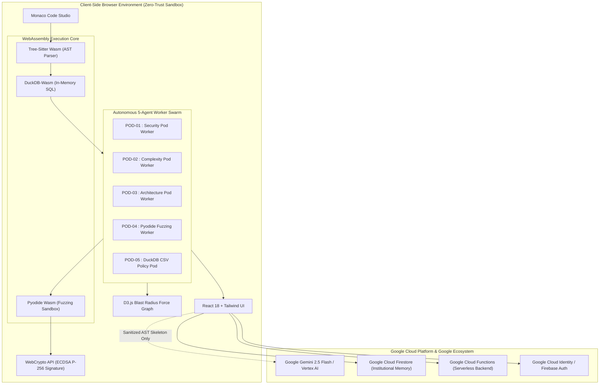

# 24/7 Intelligent Code Review (Zero-Trust Wasm Code Defense Mesh)

> **In-Browser Autonomous Multi-Agent Static Analysis, DuckDB-Wasm AST SQL Execution, Dynamic CSV Policy Intelligence, and Cryptographically Verifiable Code Defense.**

[](#)
[](#)
[](#)
[](LICENSE)

---

## 🎯 Executive Summary

**24/7 Intelligent Code Review** is a real-time, zero-trust autonomous code defense, algorithmic complexity inspection, and architectural integrity analysis mesh that executes **entirely client-side in your browser**.

By orchestrating **WebAssembly Tree-Sitter**, **DuckDB-Wasm Relational AST Storage**, **Pyodide Fuzzing Sandboxes**, and an **Autonomous 5-Agent Web Worker Swarm**, the Defense Mesh evaluates source code against team policy books and historical CSV datasets without sending raw proprietary source code over external networks.

---

## ⚡ Key Features

### 1. In-Browser Zero-Trust Static Analysis
- **Tree-Sitter WebAssembly**: Parses Python, C++, TypeScript, and JavaScript into full Abstract Syntax Tree (AST) relations directly in the browser.
- **DuckDB-Wasm Relational AST Engine**: Compiles AST nodes, identifiers, loops, functions, and call expressions into in-memory DuckDB tables (`ast_nodes`, `ast_calls`, `ast_loops`, `ast_functions`).
- **Instant SQL Rule Evaluation**: Executes relational SQL queries across AST structures in <5ms.
- **Zero Raw Source Leakage**: Code is tokenized and processed client-side. Only sanitized, anonymized skeletons are ever transmitted for optional LLM remediations.

### 2. Autonomous 5-Agent Swarm Architecture
- 🛡️ **POD-01 (Security & Deserialization Pod)**: Scans AST for unverified dynamic sinks (`pickle.loads`, `eval`, `exec`, `os.system`, SQL injection).
- ⚡ **POD-02 (Algorithmic Complexity Pod)**: Detects nested loop bottlenecks ($O(N^2)$), invariant call overhead inside iterations, and algorithmic scaling issues.
- 🌐 **POD-03 (Architecture & Blast Radius Pod)**: Analyzes cross-module call fanout, coupling density, and multi-file dependency blast radii.
- 🧪 **POD-04 (Pyodide Fuzzing Gate Pod)**: Automated property-based fuzz tests in an isolated WebAssembly Python sandbox.
- 📜 **POD-05 (DuckDB Historical CSV Policy Pod)**: Dynamically compiles natural language team CSV policies into executable SQL AST relational queries.

### 3. Dynamic CSV Policy Intelligence & Historical Datasets
- **CSV to AST Policy Compiler**: Ingests customized CSV policy files (`<id>, <type>, <description>`) and evaluates code against institutional rules in real time.
- **Dedicated History Timeline**: Separated tracking for **Code Review Evaluations** and **CSV Policy Datasets** to keep scans clean and structured.
- **Interactive Chatbot Prompt Adaptation**: Real-time context awareness dynamically switches suggested prompts between Code Defense questions and CSV Policy questions.

### 4. Live Interactive Blast Radius Force Graph (D3.js)
- **Force-Directed Graph Visualization**: Visualizes multi-file dependency trees, function-to-function call chains, and external API sinks.
- **Pulsing Violation Halos**: Real-time visual alerts for security and complexity infractions.
- **Downstream Blast Radius Isolation**: Click any node to instantly isolate and inspect all affected downstream caller chains.

### 5. Developer Quality Rating & Dynamic ELO Matrix
- **Dual-Tiered Security Index**: Real-time **Active File Health** and **Workspace Security Index** weighted by violation severity.
- **Chess-Style ELO Engine**: Tracks code quality progression across scan sessions with dynamic tier badges (*Grandmaster Elite*, *Zero-Trust Grade A*, *Intermediate Grade B*, *Remediation Required*).

### 6. File-Scoped AI Remediation & Security Assistant
- **Context-Aware Assistant**: Powered by **Google Gemini** (`gemini-2.5-flash` / Vertex AI) with local heuristic offline fallbacks.
- **One-Click In-Editor Remediation**: Automatically replaces vulnerable or slow code blocks with approved safe wrappers.

### 7. Cryptographic Attestation & CSV Export
- **ECDSA (P-256) Audit Receipts**: Generates cryptographic digital signatures verifying audit timestamps, SHA-256 code hashes, and zero-violation compliance.
- **One-Click CSV Export**: Comprehensive export of all detected findings, rule types, line numbers, and sandbox execution verdicts.

---

## 🏗️ Google Cloud Platform (GCP) & Google Ecosystem Architecture

24/7 Intelligent Code Review is built with **Google Cloud Platform (GCP)** and **Google Technologies**:

1. **Google Cloud Identity & Firebase Auth**: User authentication and OAuth credential management (`@firebase/auth`).
2. **Google Cloud Firestore**: NoSQL persistent storage for institutional memory, remediation rules, and session history (`@firebase/firestore`).
3. **Google Cloud Functions / Cloud Run**: Serverless backend callable endpoints for rule distillation and remediation orchestration (`@firebase/functions`).
4. **Google Gemini (Generative Language API / Vertex AI)**: Real-time contextual remediation engine and code defense assistant using Google's `gemini-2.5-flash` model.
5. **Google Chromium Web Standards**: Client-side execution utilizing WebAssembly, Web Workers, and WebCrypto standards on Chrome/Chromium V8.



---

## 🛠️ Tech Stack

- **Cloud Platform**: Google Cloud Platform (GCP), Firebase (Auth, Firestore, Cloud Functions, Analytics)
- **AI & Foundation Models**: Google Gemini 2.5 Flash (`@google/genai`, Vertex AI)
- **Frontend & UI**: React 18, TypeScript, Tailwind CSS, Monaco Editor, D3.js v7, Lucide Icons
- **WebAssembly Runtimes**: DuckDB-Wasm, Web Tree-Sitter, Pyodide (Python 3 in WebAssembly)
- **Security & Attestation**: WebCrypto ECDSA (P-256 / SHA-256)
- **Tooling & Build**: Vite, PostCSS, TypeScript

---

## 🚀 Getting Started

### Prerequisites
- **Node.js**: `v18.0.0` or later
- **npm**: `v9.0.0` or later

### Installation

1. **Clone the repository**:
   ```bash
   git clone https://github.com/soujasK/24-7-intelligent-code-reviewer.git
   cd 24-7-intelligent-code-reviewer
   ```

2. **Install dependencies**:
   ```bash
   npm install
   ```

3. **Configure Environment Variables** (Optional for Firebase & Gemini):
   Create a `.env` file from the provided `.env.example`:
   ```env
   # Google Gemini API Key (Direct in-browser AI Assistant & Remediation)
   VITE_GEMINI_API_KEY=your_gemini_api_key_here

   # Google Firebase / GCP Configuration (Optional)
   VITE_FIREBASE_API_KEY=your_api_key
   VITE_FIREBASE_AUTH_DOMAIN=your_project.firebaseapp.com
   VITE_FIREBASE_PROJECT_ID=your_project_id
   VITE_FIREBASE_STORAGE_BUCKET=your_project.appspot.com
   VITE_FIREBASE_MESSAGING_SENDER_ID=your_sender_id
   VITE_FIREBASE_APP_ID=your_app_id
   ```

4. **Start the Development Server**:
   ```bash
   npm run dev
   ```
   Open [http://localhost:5173/](http://localhost:5173/) in your browser.

5. **Build for Production**:
   ```bash
   npm run build
   ```

---

## 📄 License

Distributed under the MIT License. See `LICENSE` for more information.
